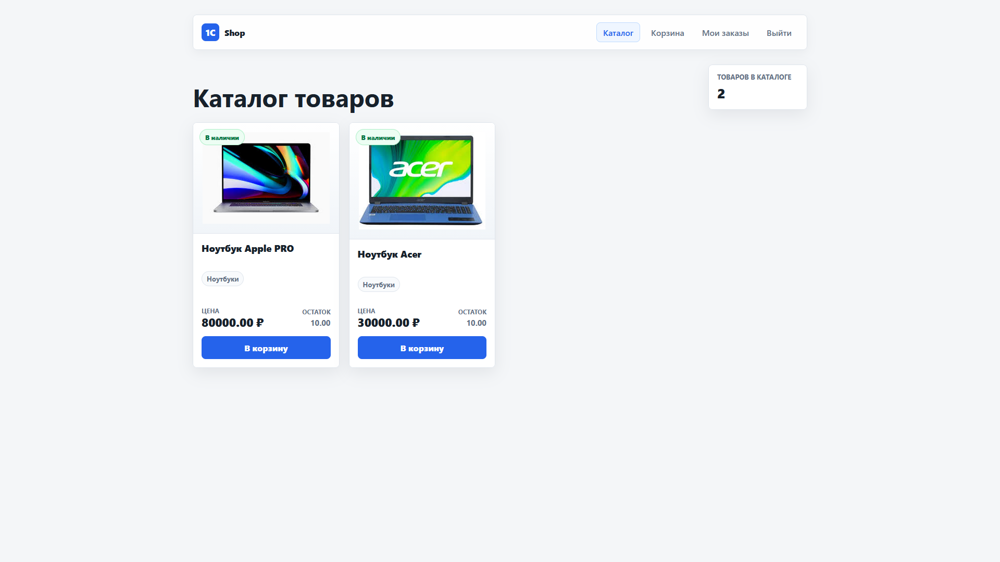
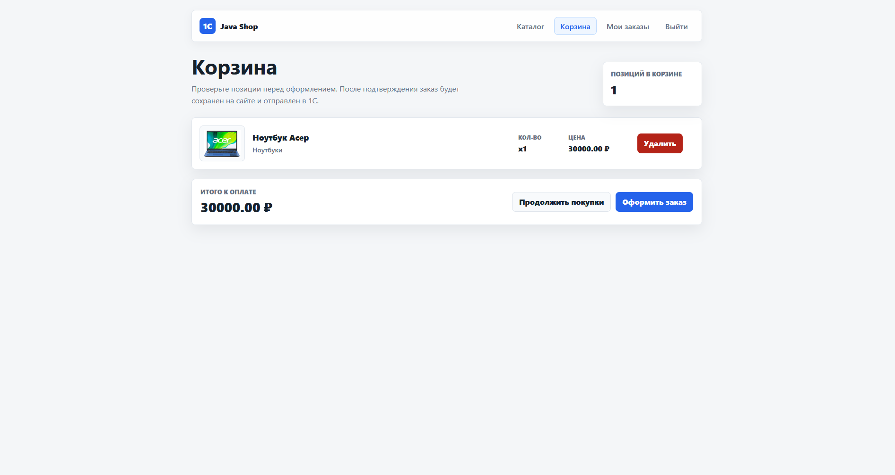
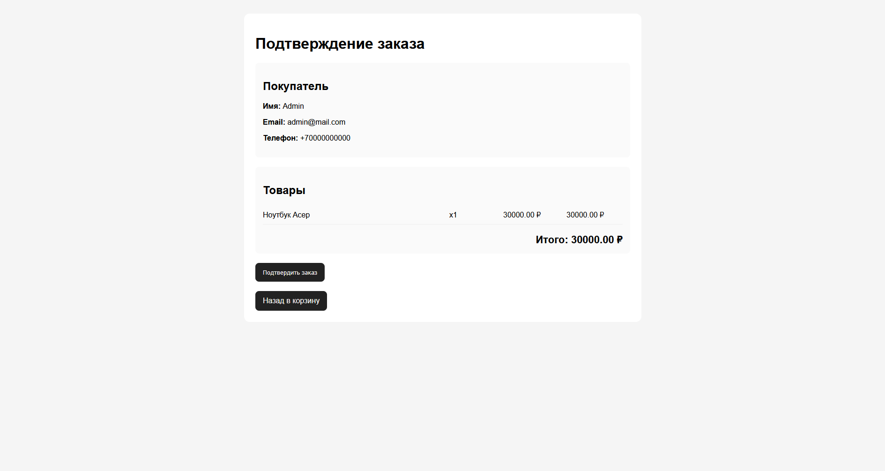
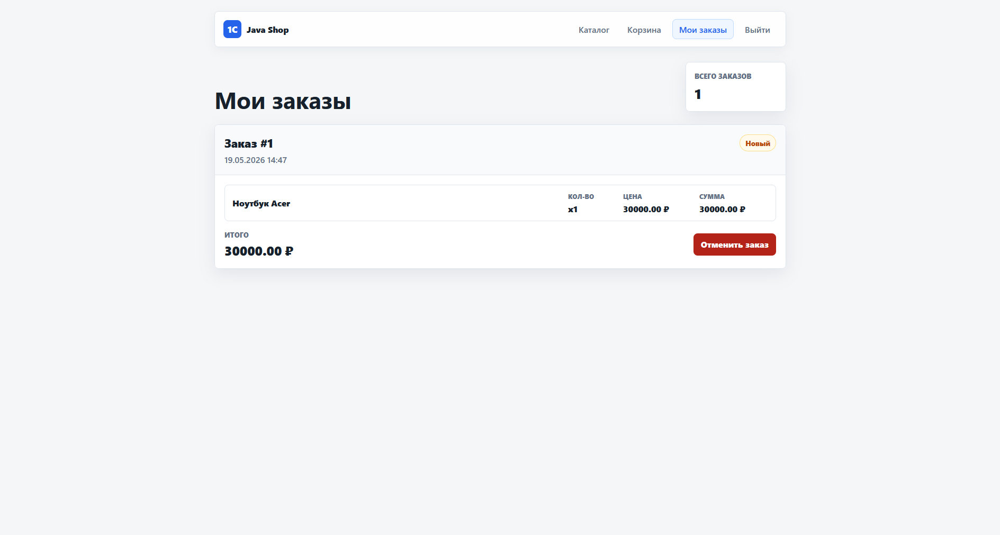
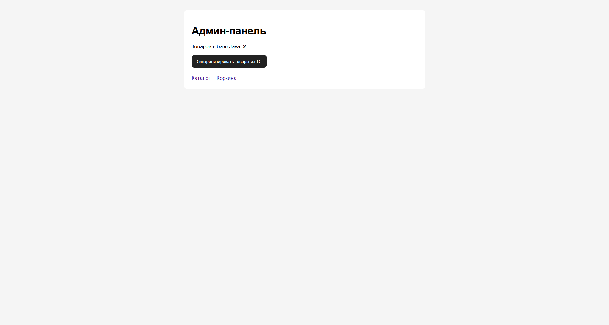
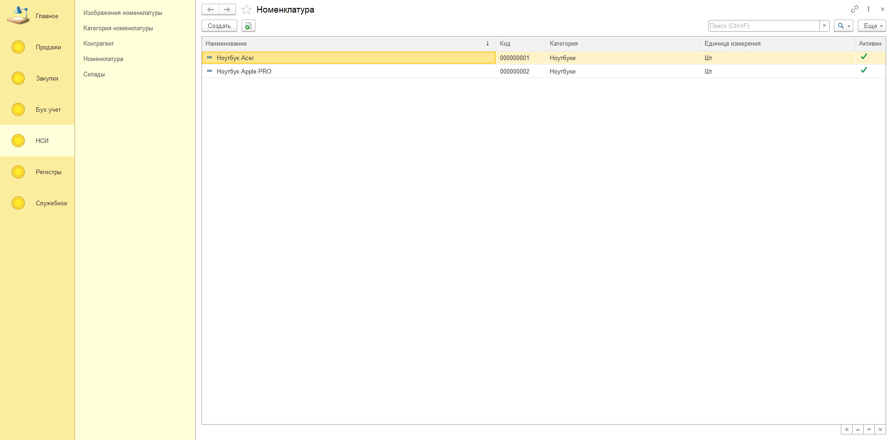
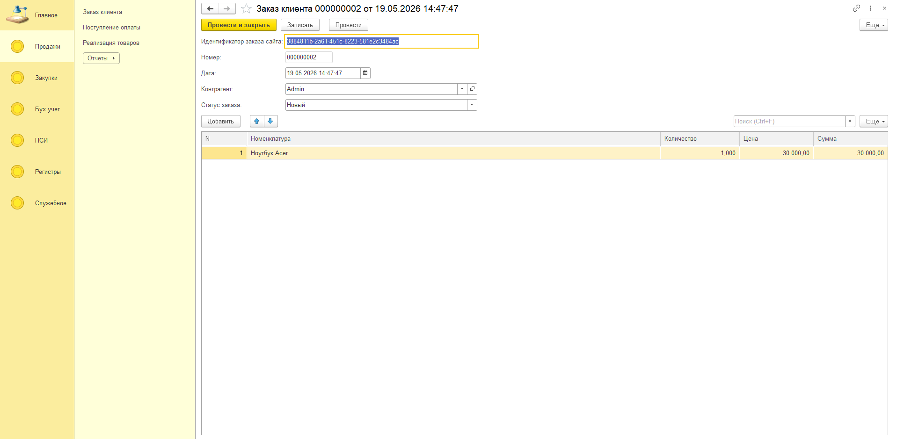
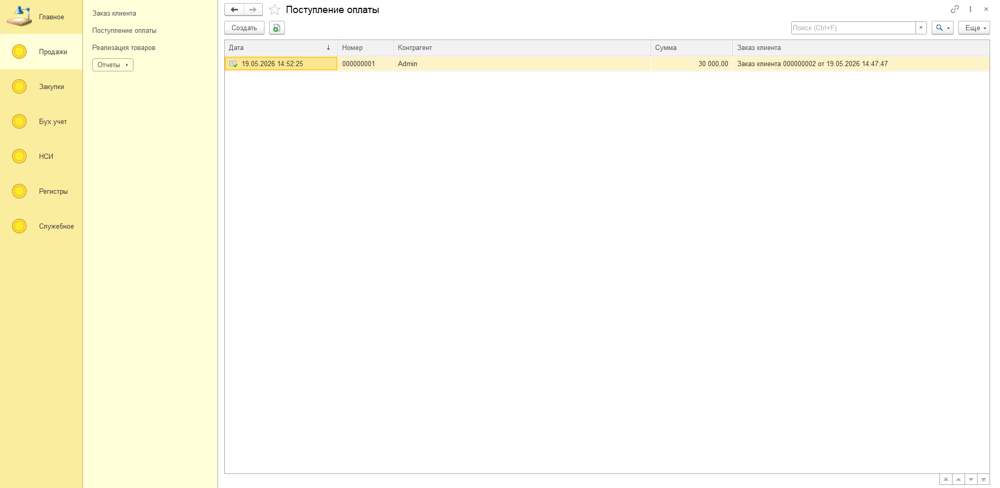
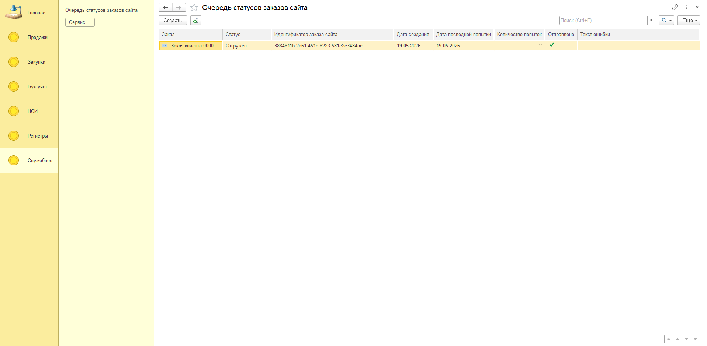

# 1C + Java Интернет-магазин

Pet-проект интернет-магазина с интеграцией **1С:Предприятие 8.5** и **Java Spring Boot**.

Проект демонстрирует связку учетной системы 1С и веб-приложения на Java: 1С хранит товары, цены, остатки, изображения, заказы и учетные документы, а Java-приложение отображает каталог, корзину, оформление заказа и личный кабинет пользователя.

<p>
  <a href="#запуск-проекта">
    
  </a>
  <a href="#1с-http-api">
    
  </a>
  <a href="#java-api">
    
  </a>
  <a href="#повторная-отправка-статусов-заказов-из-1с-в-java">
    
  </a>
  <a href="#страницы-сайта">
    
  </a>
  <a href="#скриншоты">
    
  </a>
</p>

## Быстрый переход

[Стек](#стек) |
[Архитектура](#архитектура) |
[Запуск проекта](#запуск-проекта) |
[1С HTTP API](#1с-http-api) |
[Java API](#java-api) |
[Повторная отправка статусов](#повторная-отправка-статусов-заказов-из-1с-в-java) |
[Spring Security](#spring-security) |
[Страницы сайта](#страницы-сайта) |
[Скриншоты](#скриншоты)

---

## Стек

### Backend / Web

- Java
- Spring Boot
- Spring Web
- Spring Data JPA
- Spring Security
- Thymeleaf
- PostgreSQL
- Docker
- RestClient

### 1С

- Справочники
- Документы
- Регистры сведений
- Регистры накопления
- Регистр бухгалтерии
- План счетов
- HTTP-сервисы
- JSON API
- Apache HTTP Server

---

## Архитектура

```text
1С:Предприятие
    ↓ HTTP API
Java Spring Boot
    ↓
PostgreSQL
    ↓
Thymeleaf UI
```

1С выступает как учетная система и источник истины:

```text
товары
цены
остатки
изображения
контрагенты
заказы
оплаты
реализации
проводки
отчеты
```

Java-приложение отвечает за сайт:

```text
каталог
корзина
регистрация / авторизация
оформление заказа
история заказов
отмена заказа
админ-синхронизация
```

---

## Основной бизнес-сценарий

```text
1. В 1С создается номенклатура, цена, остаток и изображение.
2. Java синхронизирует товары из 1С в PostgreSQL.
3. Пользователь открывает сайт и видит каталог товаров.
4. Пользователь регистрируется и входит в аккаунт.
5. Пользователь добавляет товар в корзину.
6. Пользователь подтверждает заказ.
7. Java сохраняет заказ в PostgreSQL.
8. Java отправляет заказ в 1С.
9. В 1С создается документ ЗаказКлиента.
10. В 1С проводится ПоступлениеОплаты.
11. В 1С проводится РеализацияТоваров.
12. Остатки списываются.
13. Java автоматически обновляет каталог после изменений в 1С.
14. Пользователь видит актуальные статусы заказов на сайте.
15. Если приложение недоступны, 1С не теряет изменение статуса заказа и автоматически доставляет его позже через очередь и регламентное задание.
```

---

## Что реализовано

### Java-приложение

- Регистрация пользователей
- Логин / logout через Spring Security
- Роли `USER` / `ADMIN`
- Каталог товаров
- Корзина
- Checkout без повторного ввода данных клиента
- Сохранение заказов в Java-БД
- Сохранение позиций заказа
- Отправка заказа в 1С
- Защита от дублей заказов через `externalOrderId`
- Страница “Мои заказы”
- Отмена заказа с сайта
- Админ-страница синхронизации товаров
- Автоматическая синхронизация товаров по запросу из 1С
- Повторная отправка статусов заказов из 1С в Java

---

## Java-модули

### Пользователи

```text
User
Role
UserRepository
AuthService
CustomUserDetailsService
AuthController
SecurityConfig
RegisterForm
```

`User.externalId` используется как внешний идентификатор пользователя для 1С.

Связь:

```text
Java User.externalId → 1С Контрагент.ИдентификаторСайта
```

---

### Товары

```text
Product
Product1cDto
ProductRepository
ProductSyncService
ProductController
ProductPageController
```

`Product.externalId` хранит UUID номенклатуры из 1С.

Связь:

```text
Java Product.externalId → 1С Номенклатура.UUID
```

---

### Корзина

```text
CartItemDto
CartService
CartController
```

Корзина хранится в `HttpSession`.

---

### Заказы

```text
WebOrder
WebOrderItem
WebOrderStatus
WebOrderRepository
WebOrderItemRepository
OrderService
OrderPageController
```

Статусы заказа:

```text
CREATED      → Создан
SENT_TO_1C   → Новый
PAID         → Оплачен
SHIPPED      → Отгружен
FAILED       → Ошибка
CANCELLED    → Отменен
```

`WebOrder.externalOrderId` отправляется в 1С как `orderId`.

Связь:

```text
Java WebOrder.externalOrderId → 1С ЗаказКлиента.ИдентификаторЗаказаСайта
```

---

## 1С-часть

### Справочники

```text
Номенклатура
КатегорииНоменклатуры
Склады
Контрагенты
ИзображенияНоменклатуры
```

---

### Документы

```text
ПоступлениеТоваров
ЗаказКлиента
ПоступлениеОплаты
РеализацияТоваров
```

---

### Регистры

```text
ЦеныНоменклатуры
ОстаткиТоваров
РезервыТоваров
ХозРасчетный
ОчередьСтатусовЗаказовСайта
```

---

### План счетов

```text
ХозРасчеты
```

Счета:

```text
41      Товары
50      Касса
60      Расчеты с поставщиками
62      Расчеты с покупателями
90.01   Выручка
90.02   Себестоимость
```

---

## 1С HTTP API

### Получение товаров

```http
GET /InfoBase/hs/site/products
```

Пример ответа:

```json
[
  {
    "id": "200169cf-496b-11f1-8c0a-d8bbc16ddaff",
    "name": "Ноутбук Acer",
    "category": "Ноутбуки",
    "active": true,
    "price": 80000,
    "stock": 5,
    "imageUrl": "/InfoBase/hs/site/products/200169cf-496b-11f1-8c0a-d8bbc16ddaff/image"
  }
]
```

---

### Получение изображения товара

```http
GET /InfoBase/hs/site/products/{id}/image
```

Возвращает бинарные данные изображения.

---

### Создание заказа

```http
POST /InfoBase/hs/site/orders
```

Пример запроса:

```json
{
  "orderId": "8c032c8e-4d7b-4a52-9d50-7ff3d88bdb47",
  "customer": {
    "siteId": "user-external-id",
    "name": "Alex",
    "phone": "123",
    "email": "alex@mail.com"
  },
  "items": [
    {
      "productId": "200169cf-496b-11f1-8c0a-d8bbc16ddaff",
      "quantity": 1
    }
  ]
}
```

Пример успешного ответа:

```json
{
  "status": "created",
  "order": "Заказ клиента 000000001"
}
```

Пример ошибки:

```json
{
  "status": "error",
  "message": "Недостаточно товара: Ноутбук Acer. Остаток: 0, требуется: 1"
}
```

---

### Отмена заказа

```http
POST /InfoBase/hs/site/orders/{orderId}/cancel
```

Пример ответа:

```json
{
  "status": "cancelled",
  "message": "Заказ отменен.",
  "order": "Заказ клиента 000000001"
}
```

---

## Java API

### Синхронизация товаров

```http
POST /api/admin/sync/products
```

Используется 1С для обновления каталога сайта после изменений.

Например:

```text
ПоступлениеТоваров проведено → 1С вызывает Java → Java обновляет товары
РеализацияТоваров проведена → 1С вызывает Java → Java обновляет остатки
Номенклатура изменена → 1С вызывает Java → Java обновляет каталог
Изображение изменено → 1С вызывает Java → Java обновляет фото
```

---

### Повторная отправка статусов заказов из 1С в Java

После изменения статуса заказа в 1С система сразу отправляет новый статус в Java:

```http
POST /api/orders/status
```

Если Java-приложение временно недоступно, 1С не теряет изменение статуса заказа и автоматически доставляет его позже через очередь и регламентное задание.

В 1С используется регистр сведений:

```text
ОчередьСтатусовЗаказовСайта

Измерения:
- Заказ: ДокументСсылка.ЗаказКлиента

Ресурсы:
- Статус: ПеречислениеСсылка.СтатусЗаказа

Реквизиты:
- ИдентификаторЗаказаСайта
- ДатаСоздания
- ДатаПоследнейПопытки
- КоличествоПопыток
- Отправлено
- ТекстОшибки
```

Регламентное задание вызывает процедуру общего модуля:

```bsl
ИнтеграцияСайтаСервер.ПовторитьОтправкуСтатусовЗаказовНаСайт()
```

Расписание:

```text
каждый день с 00:00:00 до 23:59:59
повторять каждые 300 секунд
```

300 секунд = 5 минут.

Повторно отправляются записи, где:

```text
Отправлено = Ложь
КоличествоПопыток < 10
```

После успешной повторной отправки запись помечается как `Отправлено = Истина`.

### Обновление статуса заказа из 1С

```http
POST /api/orders/status
```

Пример запроса:

```json
{
  "orderId": "8c032c8e-4d7b-4a52-9d50-7ff3d88bdb47",
  "status": "Оплачен",
  "order": "Заказ клиента 000000001"
}
```

Соответствие статусов:

```text
Новый     → SENT_TO_1C
Оплачен   → PAID
Отгружен  → SHIPPED
Отменен   → CANCELLED
```

---

## Автоматическая синхронизация

В 1С реализован общий модуль:

```text
ИнтеграцияСайтаСервер
```

Через него 1С вызывает Java-приложение.

Используются константы:

```text
АдресJavaСервера
ПортJavaСервера
ПутьСинхронизацииТоваров
ПутьОбновленияСтатусаЗаказа
```

Пример значений:

```text
АдресJavaСервера = localhost
ПортJavaСервера = 8080
ПутьСинхронизацииТоваров = /api/admin/sync/products
ПутьОбновленияСтатусаЗаказа = /api/orders/status
```

---

## Бухгалтерская логика в 1С

### Поступление товаров

```text
Дт 41 Кт 60
```

Товар поступает на склад.

---

### Поступление оплаты

```text
Дт 50 Кт 62
```

Клиент оплатил заказ.

---

### Реализация товаров

Выручка:

```text
Дт 62 Кт 90.01
```

Себестоимость:

```text
Дт 90.02 Кт 41
```

Себестоимость рассчитывается по средней стоимости остатков:

```text
Себестоимость единицы = СуммаОстаток / КоличествоОстаток
Себестоимость строки = Себестоимость единицы * Количество продажи
```

---

## Отчеты в 1С

### Остатки на складах

Показывает:

```text
Номенклатура
Склад
КоличествоОстаток
СуммаОстаток
```

Источник:

```text
РегистрНакопления.ОстаткиТоваров.Остатки()
```

---

### Продажи и прибыль

Показывает:

```text
Номенклатура
Выручка
Себестоимость
Прибыль
```

Логика:

```text
Выручка = Кт 90.01
Себестоимость = Дт 90.02
Прибыль = Выручка - Себестоимость
```

---

## Запуск проекта

### 1С-конфигурация

Файл `configuration.cf` содержит конфигурацию 1С для проекта интернет-магазина.

Как загрузить конфигурацию:

1. Создать новую информационную базу 1С.
2. Открыть базу в режиме `Конфигуратор`.
3. Перейти: `Конфигурация` → `Загрузить конфигурацию из файла`.
4. Выбрать `configuration.cf`.
5. Выполнить: `Конфигурация` → `Обновить конфигурацию базы данных`.
6. Заполнить константы интеграции:
    - `АдресJavaСервера`
    - `ПортJavaСервера`
    - `ПутьСинхронизацииТоваров`
    - `ПутьОбновленияСтатусаЗаказа`

### PostgreSQL

Запуск PostgreSQL через Docker:

```powershell
docker run --name shop-postgres -e POSTGRES_DB=shop_db -e POSTGRES_USER=postgres -e POSTGRES_PASSWORD=postgres -p 5432:5432 -d postgres:16
```

Проверка:

```powershell
docker ps
```

### Java-приложение через Docker

Для Java-приложения добавлен `Dockerfile`. Он собирает Spring Boot проект внутри Docker и запускает готовый `.jar`.

Сборка Docker-образа:

Из корня проекта выполнить:

```powershell
docker build -t onec-shop .
```

После сборки появится образ:

```text
onec-shop
```
Если PostgreSQL и 1С HTTPсервисы запущены на локальной машине, из Docker контейнера к ним нужно обращаться через `host.docker.internal`, а не через `localhost`.

После запуска сайт доступен:

```text
http://localhost:8080/products
```
---

## application.properties

Пример настроек:

```properties
spring.application.name=onec-shop

spring.datasource.url=jdbc:postgresql://localhost:5432/shop_db
spring.datasource.username=postgres
spring.datasource.password=postgres

spring.jpa.hibernate.ddl-auto=update
spring.jpa.show-sql=true
spring.jpa.properties.hibernate.format_sql=true

integration.onec.products-url=http://localhost/InfoBase/hs/site/products
integration.onec.orders-url=http://localhost/InfoBase/hs/site/orders
integration.onec.cancel-order-url=http://localhost/InfoBase/hs/site/orders/{orderId}/cancel
```

---

## Spring Security

Закрытые страницы:

```text
/cart/**
/checkout/**
/orders/**
```

Только для администратора:

```text
/admin/**
```

Открытые страницы:

```text
/
/products
/login
/register
/api/products
```

Интеграционные endpoint для 1С исключены из CSRF:

```java
.csrf(csrf -> csrf
        .ignoringRequestMatchers(
                "/api/admin/sync/products",
                "/api/orders/status"
        )
)
```

---

## Страницы сайта

```text
/products        Каталог товаров
/cart            Корзина
/checkout        Подтверждение заказа
/orders          Мои заказы
/admin           Админка синхронизации
/login           Вход
/register        Регистрация
```

---

## Скриншоты

### Java-приложение

#### Каталог товаров



#### Корзина



#### Оформление заказа



#### Мои заказы



#### Админ-синхронизация



### 1С

#### Номенклатура



#### Заказы



#### Поступление оплаты



#### Очередь статусов заказов


